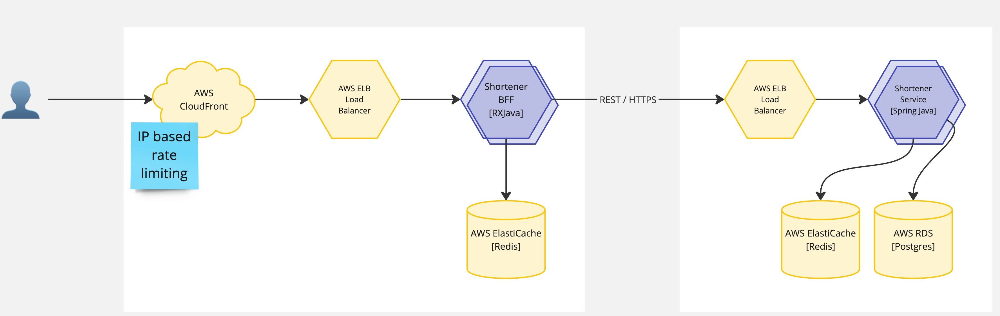

# Linkify service

A link shortener backend service

## High level architecture



## Unique Slug Generation

### Character Set

The slug is generated using a Base64 encoding scheme, which includes the following characters:

- **Alphanumeric Characters**: `A-Z`, `a-z`, `0-9`
- **Special Characters**: `-` (dash) and `_` (underscore)

### Ensuring Uniqueness

To ensure that each slug is unique, the method generates a random sequence of 8 bytes. This randomness is crucial
because it allows for a vast number of unique combinations, minimizing the risk of collisions (i.e., generating the same
slug more than once).

### Number of Possibilities

Specifically, the total number of possible slugs is approximately:

2^64 ~ 18.4 quintillion combinations (15 zeros)

## Performance assurance

1. **PostgreSQL Partitioning**: By partitioning the `shortened_urls` table by `slug` column. This will help in reducing
   the
   size of the table and improve query performance. When querying for a specific slug, the database will only search the
   partition
   where the slug belongs to, instead of scanning the entire table.
2. **Indexing**: Indexing the `slug` column in the `shortened_urls` table will help in faster retrieval of the original
   URL associated with the slug.
3. **Cache**: Using Redis as a cache to store the mapping of slugs to original URLs. This will help in reducing the load
   on the database and improve the response time for fetching the original URL.

## Pre-requisites

- Docker
- Java 23

## How to run

### Run the database with docker

```bash
cd docker
```

```bash
docker-compose up -d
```

> Make sure postgres is running on port 5432 and the redis is running on port 6379 before running the application with
`docker ps` command

### Run the application

```bash
./gradlew bootRun 
```

### Run the tests

```bash
./gradlew test
```

### Run tests with coverage

```bash
./gradlew test jacocoTestReport
```

> Jacoco test report will be generated in `build/jacocoHtml/index.html`

## URL Shortener API Documentation

### Base URL

`/v1/urls`

### Endpoints

#### 1. Get Short URL by Slug

**GET** `/v1/urls/{slug}`

Fetches the original URL associated with the provided slug.

- **Parameters:**
    - `slug` (path) - The unique slug for the short URL.

- **Response:**
    - **200 OK**: Returns the short URL information.
      ```json
      {
        "slug": "example-slug",
        "originalUrl": "https://www.example.com/original-url"
      }
      ```
    - **404 Not Found**: If the slug does not correspond to an existing short URL or if fetching fails.
      ```json
      {
        "status":404,
        "message":"URL not found for slug: example-slug"
      }
      ```

#### Example call

```bash
curl --location --request GET 'http://127.0.0.1:8080/v1/urls/DCjfshToLZ4' \
--header 'Content-Type: application/json'
```

#### 2. Create Short URL

**POST** `/v1/urls`

Creates a new short URL from the provided original URL.

- **Request Body:**
    - **Content-Type**: `application/json`
    - **Example JSON:**
      ```json
      {
        "originalUrl": "https://www.example.com",
        "owner": "Michal",
        "expirationDate": "2024-12-31T23:59:59Z"
      }
      ```

> expirationDate is optional

#### Example call

```bash
curl --location 'http://127.0.0.1:8080/v1/urls' \
--header 'Content-Type: application/json' \
--data '{
    "originalUrl": "http://google.com",
    "owner": "Michal"
}'
```

- **Response:**
    - **201 Created**: Returns the newly created short URL information.
      ```json
      {
        "slug": "DCjfshToLZ4",
        "redirectionUrl": "http://google.com"
      }
      ```
    - @**200 OK**: If the short URL already exists.
      ```json
      {
        "slug": "DCjfshToLZ4",
        "redirectionUrl": "http://google.com"
      }
      ```
    - **404 Not Found**: If the short not found or expired
      ```json
      {
        "error": "Failed to create short URL"
      }
      ```
    - **422 Unprocessable Entity**: If the request body is invalid.
      ```json
        {
          "owner": "Owner cannot be empty",
          "originalUrl": "Original URL cannot be empty",
          "expirationDate": "Expiration date must be in the future"
        }
      ```

### Error Handling

Common errors include:

- **500 Internal Server Error**: Indicates an unexpected error occurred while processing the request.

